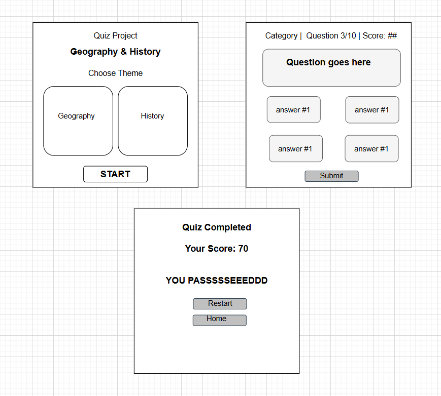

# Yaseen-Project-1

# 🧠 Pseudocode for Yaseen's Quiz: Geography & History

## 🎮 Overview
This pseudocode outlines the core logic for a quiz web app with two themes: **Geography** and **History**. It includes theme selection, question handling, scoring mechanics, and result display.

---

## 🔁 Game Flow

```plaintext
START PROGRAM

1. Show Theme Selection Screen
   - Display "Geography" and "History" options
   - Wait for user to choose a theme
   - Store selectedTheme

2. Load Questions
   - Based on selectedTheme
   - Set score = 0
   - Set currentQuestion = 0

3. Quiz Loop
   WHILE currentQuestion < totalQuestions:
       - Display question text
       - Display 4 answer buttons
       - Wait for user to click an answer

       IF selectedAnswer is correct:
           - score += 10
       ELSE:
           - score -= 5

       - currentQuestion += 1

4. End of Quiz
   IF score >= passingScore:
       - Display: "YOU PASSSSSEEEDDD"
   ELSE:
       - Display: "You failed"

   - Show final score
   - Show "Restart" and "Home" buttons

END PROGRAM

```
# Wireframe 



## You can check the [WireFrame here](https://drive.google.com/drive/folders/1LMUCB4N2V3ZH1M2t5TxaWbozZPM4_8dT?usp=sharing)

## You can check the [Trello To Do List here](https://trello.com/invite/b/686e6356dd76c4f90af1e074/ATTIa5090a38d96e271c7c063ae7ace02ab99A80F9AA/ga-project-1)


## You ca check the [Deployed Link](http://yaseen-quiz-hardcore.surge.sh/)

